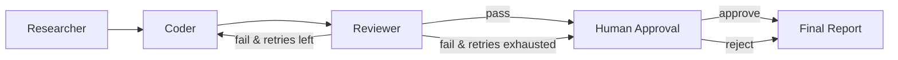

<p align="center">
  
  
  
  
  
</p>

<h1 align="center">Research → Code → Review</h1>
<p align="center">
A typed, checkpointed, multi-agent pipeline that researches, implements, tests, and reports on coding tasks — with a human veto before anything touches disk.
</p>

---

## What It Does

Given a natural-language task, the system autonomously runs through five stages:

1. **Researcher** — generates targeted search queries and collects results via an MCP docs-search server
2. **Coder** — synthesizes research into self-contained Python code with inline assertions
3. **Reviewer** — executes the generated code inside a Docker sandbox (no network, 256 MB RAM limit, 20 s timeout) and records pass/fail
4. **Human Approval** — the graph pauses via `interrupt()`; no code is written to disk until a human approves
5. **Final Report** — assembles research notes, code, test results, approval history, and token usage into a structured markdown report

If tests fail, the coder receives the failure output and retries (up to a configurable bound). If the retry budget is exhausted, the pipeline escalates to the human with the failing state rather than looping indefinitely.

---

## Architecture



All routing logic lives in a single pure-Python function (`graph/supervisor.py::route_after_review`). The only branch point is evaluation of test pass/fail against a retry counter — no LLM "decides" the next step.

### State Model

The graph's shared state is a typed `TypedDict` (`graph/state.py::GraphState`) with explicit fields for research notes, generated code, test results, iteration count, approval status, execution history, and token usage. Every node reads from and writes to this schema — the type system catches structural mismatches at import time rather than runtime.

---

## Key Design Decisions

| Decision | Implementation | Rationale |
|----------|---------------|-----------|
| **Tool discovery** | Model Context Protocol (MCP) via `mcp` Python SDK | MCP servers are independent processes communicating over JSON-RPC/stdio. Swapping a server for a different implementation — even in another language — requires no agent code changes. |
| **Code isolation** | Docker container (`python:3.11-slim`, `--network none`, `--memory 256m`) | Generated code never runs in-process or on the host. Falls back to `subprocess` with a timeout if Docker is unavailable, with an explicit log warning about weaker isolation. |
| **Checkpointing** | SQLite-backed `SqliteSaver` | Every graph step is persisted. Interrupted runs resume from the last checkpoint using `--resume <thread_id>`. Postgres option in `docker-compose.yml` for production. |
| **Provider resilience** | Groq → OpenAI → OpenRouter fallback chain | Each LLM call is wrapped with LangChain's `.with_fallbacks()`. Only the keys you set are wired in — no silent degradation from unconfigured fallbacks. |
| **Cost-aware model routing** | Separate models per role with env-var overrides | Researcher uses cheaper models (e.g. Llama 3.1 8B); Coder uses more capable ones (e.g. Llama 3.3 70B). Configurable via `CODER_MODEL_GROQ`, `RESEARCHER_MODEL_OPENAI`, etc. |

---

## Quick Start

### Prerequisites

- Python 3.11+
- Docker (optional — enables sandboxed execution; falls back to subprocess without it)

|### Setup

Clone the repo, create a virtual environment, install dependencies, and configure your API keys:

**macOS / Linux:**

```bash
git clone https://github.com/khalequzzamanlikhon/research2code.git
cd research2code
python3 -m venv .venv
source .venv/bin/activate
pip install -r requirements.txt
cp .env.example .env   # then edit .env with your API keys
```

**Windows (Command Prompt / PowerShell):**

```cmd
git clone https://github.com/khalequzzamanlikhon/research2code.git
cd research2code
python -m venv .venv
.venv\Scripts\activate
pip install -r requirements.txt
copy .env.example .env   :: then edit .env with your API keys
```

**Windows (Git Bash / MSYS2):**

```bash
git clone https://github.com/khalequzzamanlikhon/research2code.git
cd research2code
python -m venv .venv
source .venv/Scripts/activate
pip install -r requirements.txt
cp .env.example .env   # then edit .env with your API keys
```

Only `GROQ_API_KEY` is required. The system falls back to OpenAI (if `OPENAI_API_KEY` is set) or OpenRouter (if `OPENROUTER_API_KEY` is set) when Groq rate-limits or errors.

### Run

**CLI:**

```bash
python run_cli.py "Implement an LRU cache and write tests for it"
# Resume an interrupted run:
python run_cli.py --resume <thread_id>
```

**Streamlit UI:**

```bash
streamlit run frontend/app.py
```

### Test

```bash
pytest tests/ -v
```

No API keys required — the routing logic and sandbox executor run fully offline.

---

## Benchmarking

```bash
python scripts/run_benchmark.py          # all 5 tasks
python scripts/run_benchmark.py --quick  # first 3 tasks
```

Output: raw results in `reports/benchmark_results.json` and a formatted markdown report. Metrics: test pass/fail per task, iteration count, token consumption (input/output/total), wall-clock duration, approval outcome.

---

## CI

The `.github/workflows/ci.yml` workflow runs on every push and PR:

- **Import check** — verifies the module graph resolves
- **Unit tests** — `pytest tests/ -v` (offline, no API keys)
- **Graph compilation** — verifies the state machine compiles

All three checks require zero credentials, so external contributors can validate changes without configuration.

---

## Limitations

- Single-file code generation only — no multi-file scaffolding
- No A2A protocol support — agents communicate with MCP tool servers only, not with other agent systems
- No persistent package cache in the Docker sandbox — `pip install` runs fresh on every execution
- Token tracking uses model-level estimates rather than per-call provider SDK counts

---

## License

MIT
