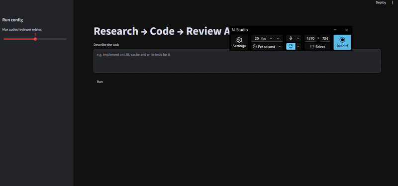
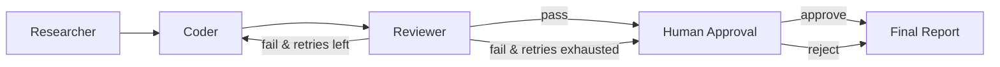

<h1 align="center">Research → Code → Review</h1>

<p align="center">
  
  
  
  <a href="https://github.com/khalequzzamanlikhon/research2code/actions/workflows/ci.yml"></a>
  
</p>

I built this to see how far a small team of LLM agents can take a coding task on its
own, while keeping a person in control. You give it a task in plain English. One agent
looks things up, one writes the code with tests, one runs the tests in a sandbox, and
nothing is written to disk until a human approves it.

<p align="center">
  
</p>

## What it does

1. **Researcher:** writes search queries and collects results through an MCP
   docs-search server.
2. **Coder:** turns the research into self-contained Python code with assert-based tests.
3. **Reviewer:** runs the code in a Docker sandbox (no network, 256 MB RAM, 20 s
   timeout) and records whether the tests passed.
4. **Human approval:** the graph pauses with `interrupt()`; no code is written to disk
   until a person approves.
5. **Final report:** collects the research notes, code, test results, approval history
   and token usage into one markdown report.

If the tests fail, the coder gets the failure output and tries again, up to a set
number of retries. If it runs out of retries, the task goes to the human with the
failing state instead of looping forever.

## How it's built



I kept all the routing in one plain Python function
(`graph/supervisor.py::route_after_review`). The only decision is whether the tests
passed and how many retries are left; no LLM decides what happens next, so the flow is
predictable and easy to test.

The shared state is a typed `TypedDict` (`graph/state.py::GraphState`) with fields for
the research notes, code, test results, iteration count, approval status, history and
token usage. Every node reads and writes this one schema, so a structural mistake shows
up at import time instead of halfway through a run.

## Design choices

| Choice | How | Why |
|---|---|---|
| Tools over MCP | The `mcp` Python SDK | Each MCP server is a separate process talking JSON-RPC over stdio, so I can swap a server, even for one in another language, without touching the agents. |
| Isolated execution | Docker (`python:3.11-slim`, `--network none`, `--memory 256m`) | Generated code never runs inside the app or on the host. Without Docker it falls back to a subprocess with a timeout, and logs a warning that isolation is weaker. |
| Checkpoints | SQLite `SqliteSaver` | Every step is saved, so an interrupted run resumes with `--resume <thread_id>`. `docker-compose.yml` has a Postgres option. |
| Provider fallback | Groq, then OpenAI, then OpenRouter | Each LLM call uses LangChain's `.with_fallbacks()`, and only the providers you have keys for are added. |
| A model per role | Environment-variable overrides | The researcher uses a cheaper model (e.g. Llama 3.1 8B), the coder a stronger one (e.g. Llama 3.3 70B). Set with `CODER_MODEL_GROQ`, `RESEARCHER_MODEL_OPENAI`, and so on. |

## Quick start

You need Python 3.11+. Docker is optional; without it, code runs in a subprocess with
a timeout.

**macOS / Linux:**

```bash
git clone https://github.com/khalequzzamanlikhon/research2code.git
cd research2code
python3 -m venv .venv
source .venv/bin/activate
pip install -r requirements.txt
cp .env.example .env   # then add your API keys
```

**Windows (Command Prompt / PowerShell):**

```cmd
git clone https://github.com/khalequzzamanlikhon/research2code.git
cd research2code
python -m venv .venv
.venv\Scripts\activate
pip install -r requirements.txt
copy .env.example .env   :: then add your API keys
```

**Windows (Git Bash / MSYS2):**

```bash
git clone https://github.com/khalequzzamanlikhon/research2code.git
cd research2code
python -m venv .venv
source .venv/Scripts/activate
pip install -r requirements.txt
cp .env.example .env   # then add your API keys
```

Only `GROQ_API_KEY` is required. If Groq rate-limits or fails, it falls back to OpenAI
(if `OPENAI_API_KEY` is set) or OpenRouter (if `OPENROUTER_API_KEY` is set).

### Run

```bash
python run_cli.py "Implement an LRU cache and write tests for it"
python run_cli.py --resume <thread_id>     # continue an interrupted run
streamlit run frontend/app.py              # or use the UI
```

### Test

```bash
pytest tests/ -v
```

The tests need no API keys: the routing logic and the sandbox run fully offline.

## Benchmark

```bash
python scripts/run_benchmark.py          # all 5 tasks
python scripts/run_benchmark.py --quick  # first 3 tasks
```

It writes raw results to `reports/benchmark_results.json` and a markdown report, with
pass/fail, iterations, tokens, time and the approval outcome for each task.

My last run was the quick set of 3 tasks (Fibonacci, an LRU cache, a rate limiter). All
3 passed their tests; the rate limiter needed one retry. They used 900–1,800 tokens and
13–21 seconds each. Web search was stubbed in that run (no Tavily key), so it tested the
code–test–retry loop, not the research step.

## CI

`.github/workflows/ci.yml` runs on every push and pull request: an import check, the
unit tests (offline) and a check that the graph compiles. None of them need
credentials, so anyone can run them.

## Limitations

- The agents talk only to MCP tool servers, not to other agent systems (no A2A).
- The Docker sandbox installs packages fresh on each run. A pip cache volume
  (`$AGENT_PIP_CACHE_DIR`) and a custom image (`$AGENT_SANDBOX_IMAGE`) reduce this.
- Token costs come from a per-model price table (`tools/token_tracker.py`), shown in
  dollars in the final report.
- The benchmark is small (5 tasks) and simple; it shows the loop works, not how well it
  handles hard tasks.

## License

MIT
